# Open office door remotely  

## Goal  

Open office door with magnetic lock in office without pressing a button near it.  

## Solution  

Hook microcontroller to button. Microcontroller connects to office WiFi and hosts web page with button. When you press button on the web page microcontroller connects button's wires togeather with optical decoupler for e second to imitate button press. Microcontroller gets power from door's controller power supply unit (12 V) via voltage regulator.     

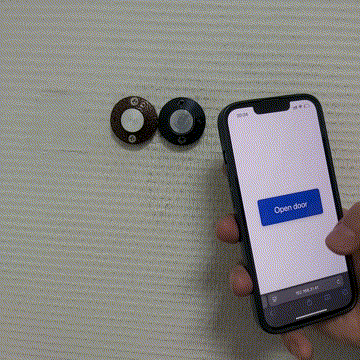

Page with "Open door" button opened in browser:
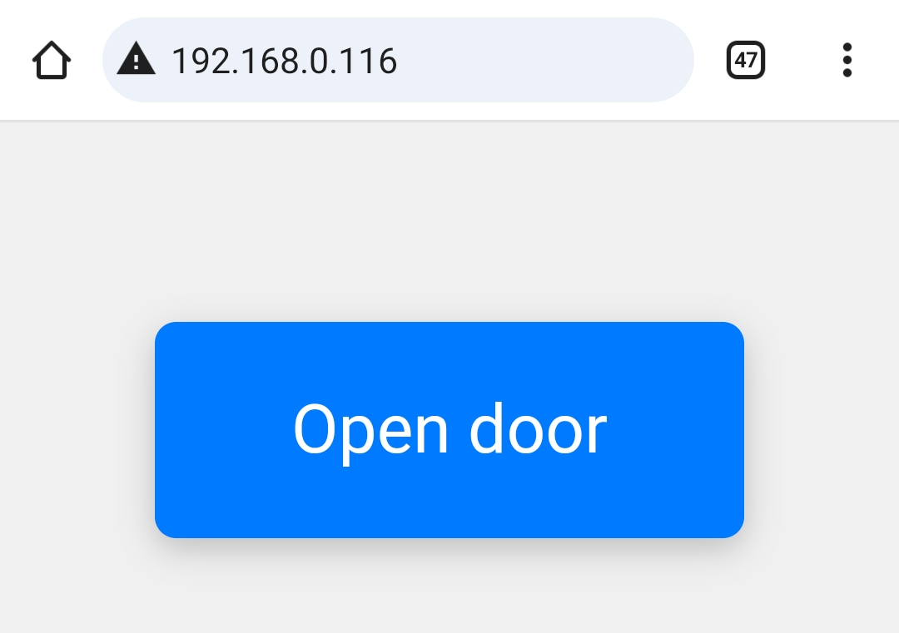

## Implementation  

Hardware used:   
- Esp32c3 mini - microcontroller 
- EL817 - optical decoupler
- LM2596 - voltage regulator 

LM2596 comes on board with all perepherial components needed and with ouput voltage tuning knob. Set it to 5 V output voltage and connected to microcontroller with USB type-c wire.  
EL817 decoupler was placed on piece of breadboard and current limiting resistor (around 300 Ohm) was added.  

For testing purpose assembled circuit with green LED on breadboard powered with separate USB powerbank.   
 
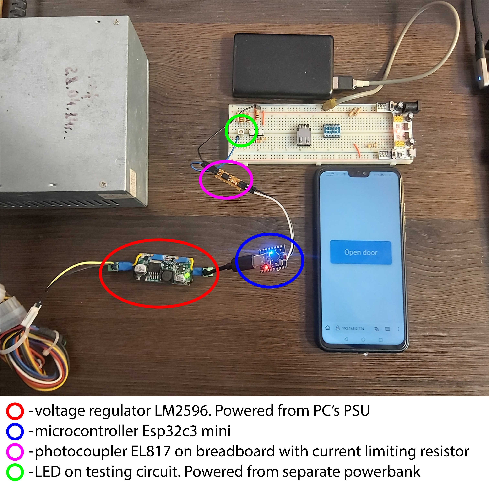  

Hook up to button as "proof of concept". Controller is powered from USB powerbank.   
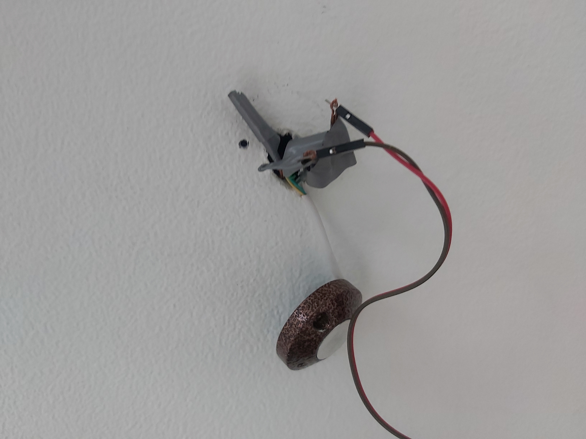  
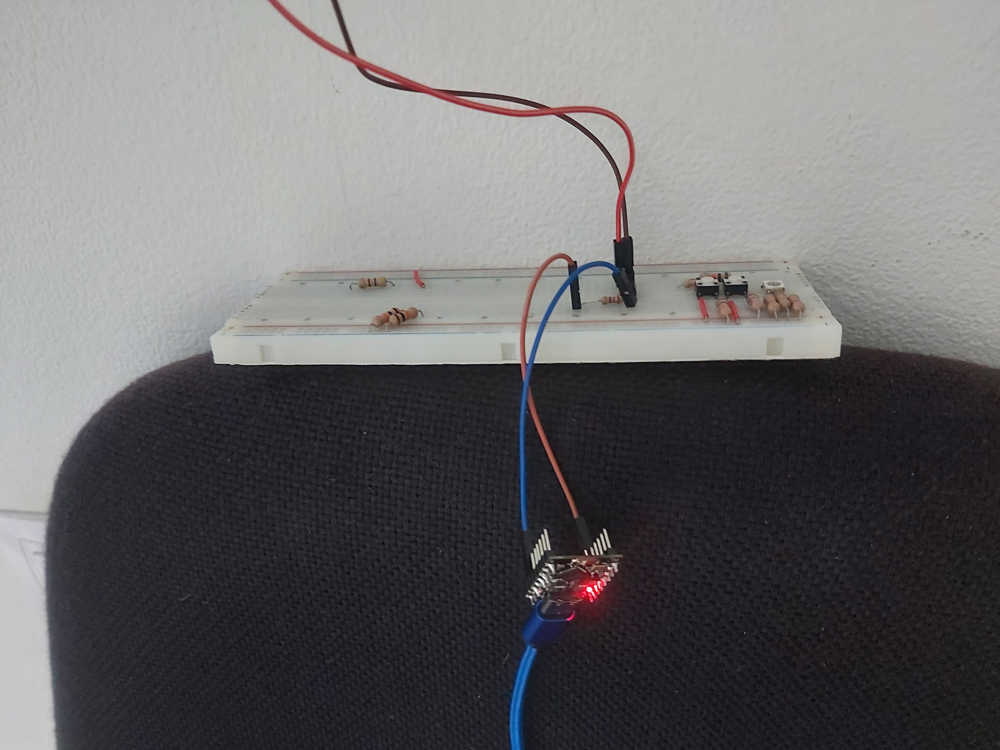  
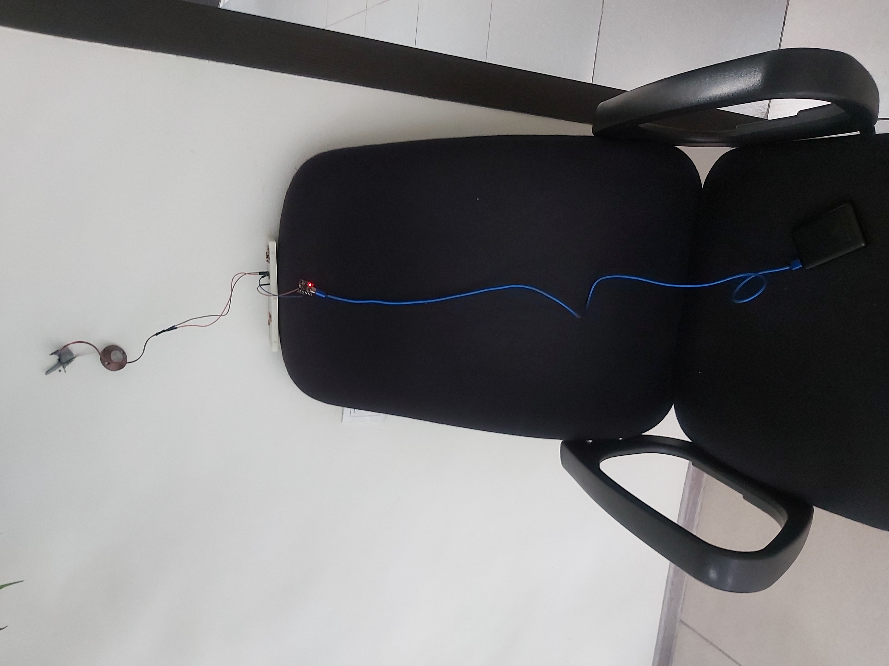  

Disassembly buttons:  
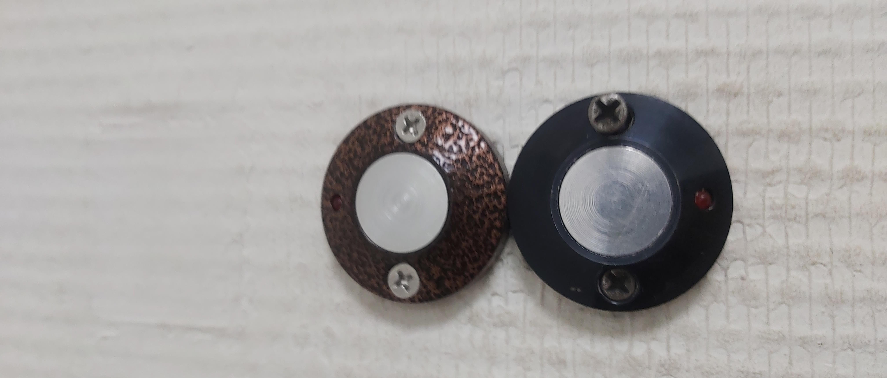  
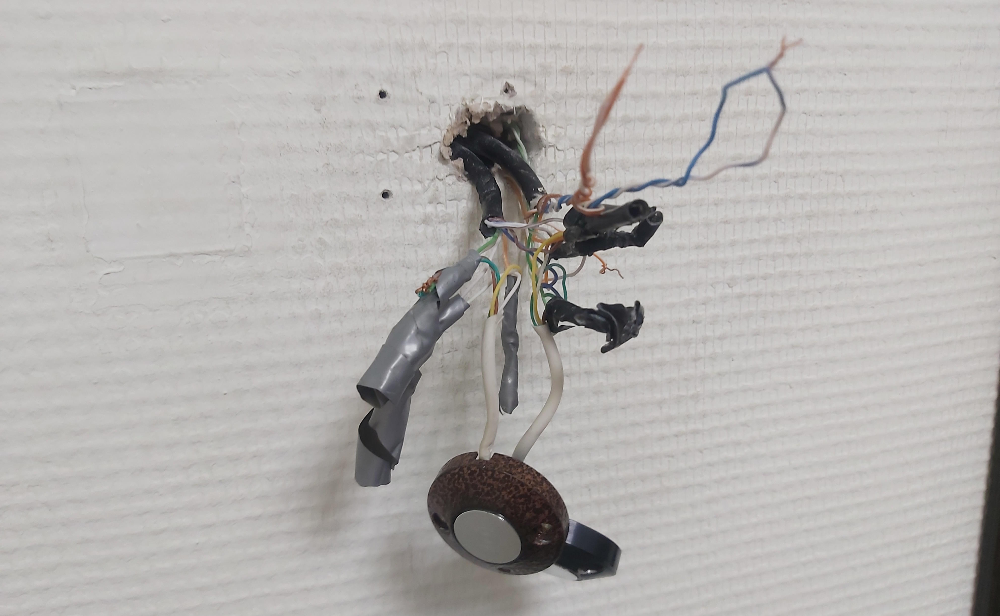  

Install controller board:  
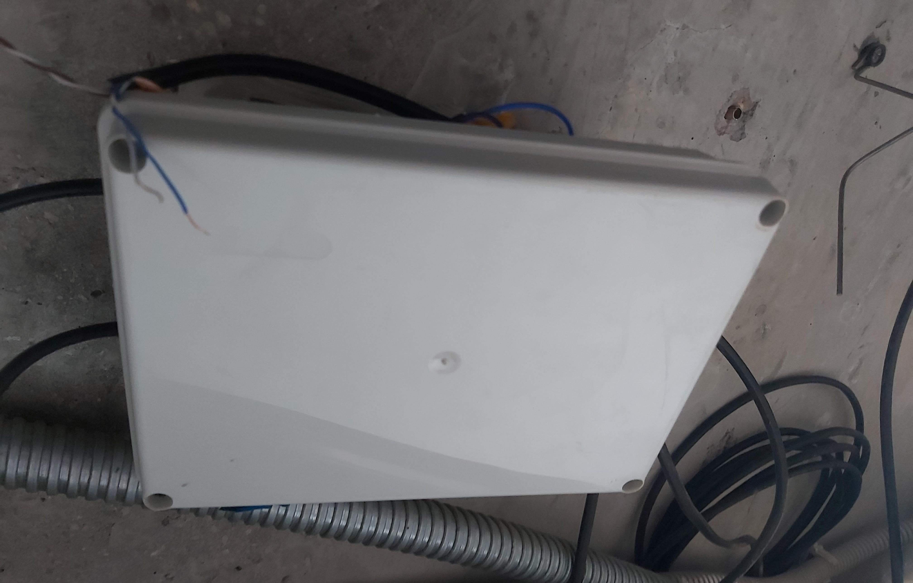  
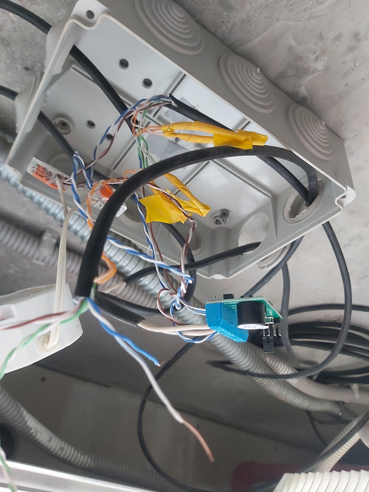  
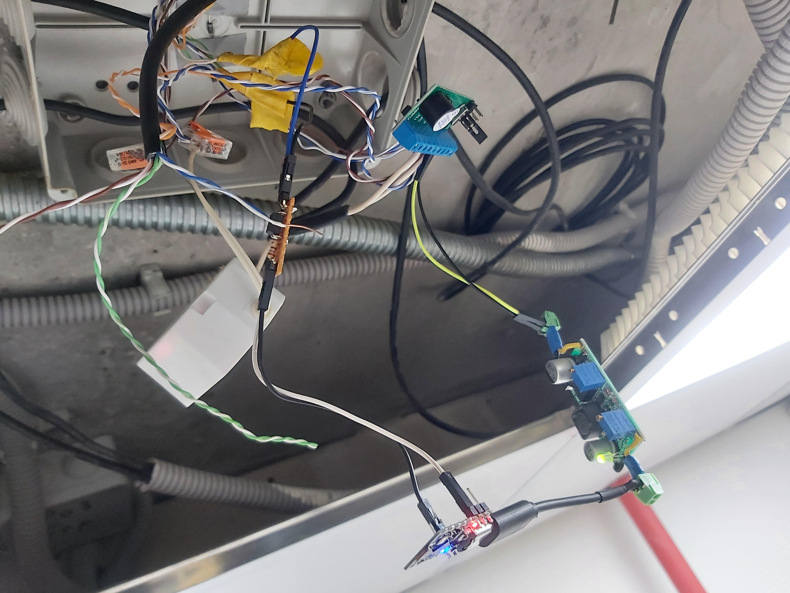  
